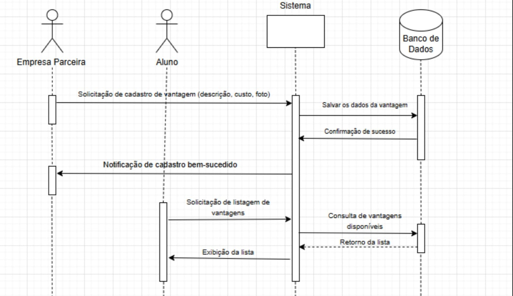

# Diagrama de Sequência: Envio de Moedas e Consulta de Extrato

  

### Descrição Geral:

Este diagrama representa dois casos de uso:

- O professor distribui moedas para um aluno.
- Alunos e professores consultam seus extratos de transações.
 

# Diagrama de Sequência: Cadastro e Listagem de Vantagens

  

## Descrição Geral:

Esse diagrama mostra como a empresa parceira cadastra uma vantagem e como os alunos visualizam as vantagens disponíveis.