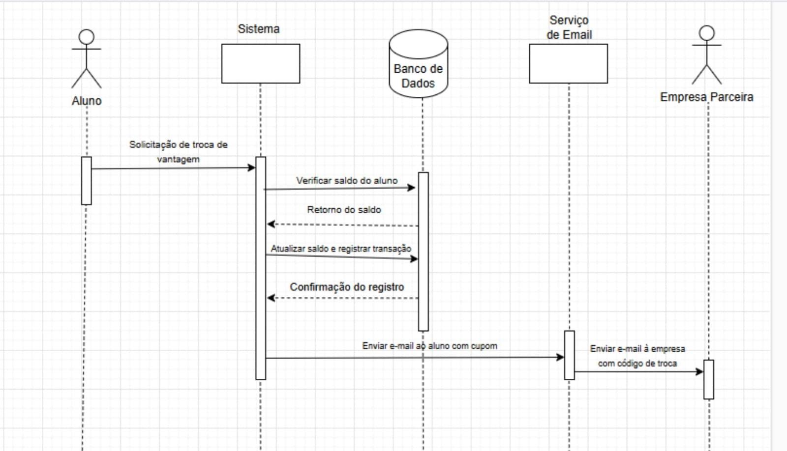

# Diagrama de Sequência: Troca de Vantagens

  

## Descrição Geral:

Demonstra o processo em que o aluno troca moedas por vantagens, incluindo o envio de emails para o aluno e para a empresa parceira.